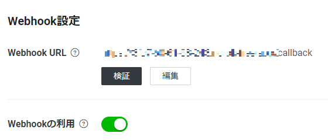

# qiita_bad_article_checker
---

## 0. 環境
- RaspberryPi 4B
- kernel：Linux [ホスト名] 5.15.32-v8+ #1538 SMP PREEMPT Thu Mar 31 19:40:39 BST 2022 aarch64 GNU/Linux
- OS：Debian GNU/Linux 11 (bullseye)
- Docker：23.0.1

## 1. LINE Developersアカウントの取得
下記記事を参考に`LINE Developers`アカウントを取得
- [LINE公式アカウントのMessaging APIつかってみた](https://qiita.com/sugimon/items/6c54cb17864c5fd33ddc)

## 2. ngrokアカウントを取得
下記記事を参考に`ngrok`アカウントを取得
- [アカウントが必要になったngrokの利用準備手順](https://zenn.dev/protoout/articles/47-ngrok-setup-2022)

## 3. コンテナ構築(Docker)
プロジェクトディレクトリに移動して`.env`ファイルを作成
```bash
CHANNEL_SECRET=[LINE Developersチャネルシークレット]
CHANNEL_ACCESS_TOKEN=[LINE Developersアクセストークン]
```

プロジェクトディレクトリでDockerコンテナをビルド
```bash
# ビルド
$ docker-compose up -d --build
```

## 4. localhost接続確認
curlでエラーにならないか確認
```bash
$ curl http://localhost:8000

<<<<<<< HEAD
{"status":"ok"}
=======
# コンテナに入る
$ docker exec -it [コンテナID] bash

# コンテナの中からAPIサーバ起動
$ uvicorn main:app --reload
>>>>>>> 0f5741563fdbbf0d045dedceb27dc463245a9c15
```

# 5.ngrokでWebサイトを公開
下記からOSを選択して`ngrok`をダウンロードして解凍、配置する
- [ngrok – download](https://ngrok.com/download)

```bash
# （Linuxなら）ngrok aptでインストール
$ curl -s https://ngrok-agent.s3.amazonaws.com/ngrok.asc | sudo tee /etc/apt/trusted.gpg.d/ngrok.asc >/dev/null && echo "deb https://ngrok-agent.s3.amazonaws.com buster main" | sudo tee /etc/apt/sources.list.d/ngrok.list && sudo apt update && sudo apt install ngrok

# アクセストークン認証
$ ngrok config add-authtoken [ngrokアクセストークン]

# 公開(必要に応じてFireWallを開放する)
$ ngrok http 8000

# バックグランド実行して公開したい場合
$ nohup ngrok http 8000 &
```

## 6.LINE DevelopersのWebhook URL設定

表示されたngrokの公開URL ＋ '/callback' を`LINE Developers`の`Webhook URL`にセット
```
# 例：公開URL ＋ '/callback'
https://9999-999-999-99-999.ngrok.app/callback
```



## 参考にさせて頂いたサイト
- [クソ記事チェッカー](https://qiita.com/watanabe-tsubasa/items/6904aa771276c554645e?utm_campaign=popular_items&utm_medium=twitter&utm_source=dlvr.it)
- [docker-composeでFastAPIの環境を構築する](https://qiita.com/kurodenwa/items/653c7b74f2f8ba5b7c0d)
- [ngrokをバックグラウンドで実行する備忘録](https://qiita.com/charokoukuu/items/bc7b7c3e67b9c8b8e047)
