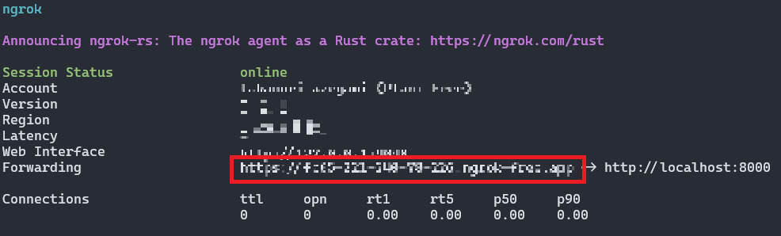

# qiita_bad_article_checker
---

## 1. LINE Developersアカウントの取得
下記記事を参考に`LINE Developers`アカウントを取得
- [LINE公式アカウントのMessaging APIつかってみた](hhttps://qiita.com/sugimon/items/6c54cb17864c5fd33ddc)

## 2. ngrokアカウントを取得
下記記事を参考に`ngrok`アカウントを取得
- [アカウントが必要になったngrokの利用準備手順](https://zenn.dev/protoout/articles/47-ngrok-setup-2022)

## 3. Python環境構(Docker）
プロジェクトディレクトリに移動して`.env`ファイルを作成
```bash
CHANNEL_SECRET=[LINE Developersチャネルシークレット]
CHANNEL_ACCESS_TOKEN=[LINE Developersアクセストークン]
```

プロジェクトディレクトリでDockerコンテナをビルド
```bash
# ビルド
$ docker-compose up -d --build
```

## 4. APIサーバを公開
```bash
# コンテナID確認
$ docker ps

# コンテナに入る
$ docker exec -it [コンテナID] bash

# コンテナの中からAPIサーバ起動
$ uvicorn main:app

# コンテナから出る
$ exit
```

# 5.ngrokでWebサイトを公開
下記からOSを選択して`ngrok.exe`をダウンロードして解凍、配置する
- [ngrok – download](https://ngrok.com/download)

```bash
# アクセストークン認証
$ ngrok config add-authtoken [アクセストークン]

# 公開(必要に応じてFireWallを開放する)
$ ngrok http 8000
```

## 6.LINE DevelopersのWebhook URL設定

表示されたngrokの公開URL ＋ '/callback' を`LINE Developers`の`Webhook URL`にセット
```
# 例：公開URL ＋ '/callback'
https://9999-999-999-99-999.ngrok.app/callback
```

## 7.公開URLにアクセスする


## 参考にさせて頂いたサイト
- [クソ記事チェッカー](https://qiita.com/watanabe-tsubasa/items/6904aa771276c554645e?utm_campaign=popular_items&utm_medium=twitter&utm_source=dlvr.it)
